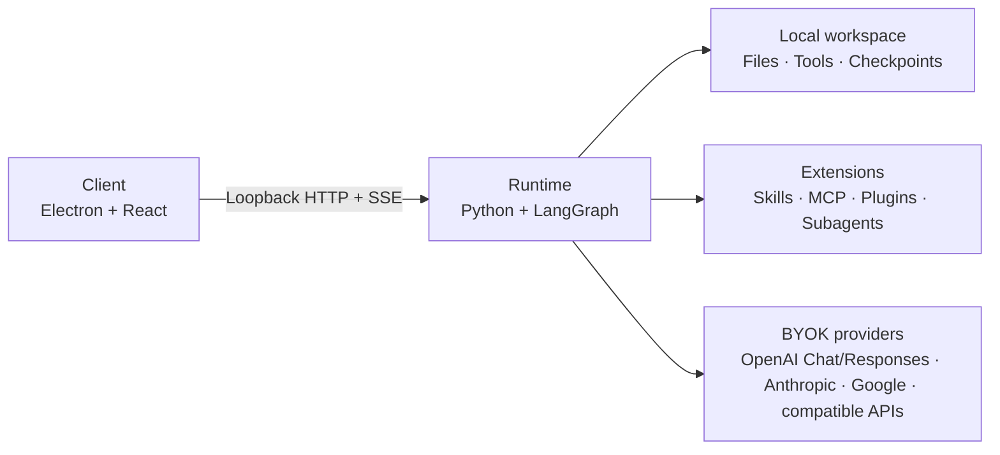

<div align="center">

# 石间 · SheJane

### A local-first Client and Agent Runtime

Run tool-using agents with workspaces, permissions, checkpoints, Skills, MCP, and deterministic plugins on your own machine.

[](https://github.com/jimmyrogue/SheJane/actions/workflows/ci.yml)
[](./LICENSE)


English · [简体中文](./README.zh-CN.md)

</div>

## Why SheJane

- The local Runtime owns the agent loop, tool execution, permissions, checkpoints, and workspace access.
- The Electron app is the official desktop client, not the execution kernel. Future clients can use the same Runtime protocol.
- Skills, MCP servers, subagents, and deterministic plugins extend the Runtime without adding product-specific integrations to its core.

## How it fits together



Client and Runtime communicate over loopback HTTP with a pairing token. A failed Runtime surfaces as a local error and never switches execution paths silently.

The repository has exactly two product modules:

```text
client/                 # UI, Electron lifecycle, and Runtime state projection
runtime/                # execution core, protocol, SDK, plugins, and tests
├── src/shejane_runtime/
├── sdk/
└── plugins/
```

Runtime is independently runnable and testable. The SDK and plugins live below it because Runtime owns their contracts; they remain separately buildable packages, not a third product module.

## What is included

| Area | Current implementation |
|---|---|
| Runtime | LangGraph and Deep Agents loop, streaming events, checkpoints, recovery, planning, verification, memory, and human approval |
| Local tools | Workspace files, read-only-workspace/no-network sandboxed shell execution, Office operations, web fetch, clipboard approval, and scheduled runs |
| Extensions | Skills, MCP servers, deterministic WASI/Managed Worker plugins, fixed macOS Computer Use, on-demand macOS/Windows Browser QA and OCR capabilities, subagents, and configurable middleware |
| Client | Electron and React UI, local Runtime conversation projection, previews, model-service settings, and workspace controls |
| Runtime SDK | Public TypeScript client for commands, SSE, snapshots, errors, and generated protocol types |

Business-platform connectors are not built into the Runtime. Future integrations should use standard tools or MCP.

The plugin platform is a preview. WASI packages can install and execute through the Runtime-owned Action protocol. Managed Worker packages stay fail-closed until the current platform's production isolation and release Gate passes. SheJane's fixed [Computer Use](./runtime/plugins/computer-use), [Browser QA](./runtime/plugins/browser-qa), and [OCR](./runtime/plugins/ocr) packages use reserved Runtime-owned adapters and still pass through Action approval, receipts, strict schemas, and content-addressed package/asset storage. Browser QA and OCR publish native macOS arm64 and Windows AMD64 Runtime Assets beside each Client release and download the exact asset when the enabled capability is first bound; Computer Use remains macOS arm64 only. See the [plugin developer guide](./docs/plugins/developer-guide.md) for the public package contract and local tooling.

### Agent collaboration today

SheJane has three bounded collaboration paths. Synchronous `task()` remains the cheapest manager-as-tools path. `team.run` adds a checkpointed same-Run graph with parallel fan-out, reducers, reviews, and explicit handoff edges. Work that must survive time or process boundaries becomes an independently addressable durable child Run with its own Job, Attempt, checkpoint, usage, cancellation, steering, and typed mailbox.

The Runtime coordinator freezes child dependencies, required/best-effort/quorum completion policy, and exact workspace-file ownership. Parent completion automatically waits for required/quorum work and cancels non-detached remainder; parent failure/cancellation propagates to child Runs. `GET /v1/runs/:root/collaboration` gives desktop and future mobile clients one cursor-safe projection of members, waits, messages, artifacts, dependencies, resource owners, and completion state.

This is still intentionally bounded: one durable child level, eight children per parent, no open-ended swarm, and no hidden shared chain-of-thought.

Independent Agent services can connect through the standalone `shejane-a2a-gateway`. It maps A2A 1.0 JSON-RPC Tasks, Messages, Artifacts, SSE, push notifications, peer/OIDC/mTLS identity, and tenant-scoped external IDs onto Runtime-owned Runs without mounting public routes in the loopback Runtime. The declared binding passes the pinned official TCK MUST suite and 14 Python/Go/TypeScript ITK scenarios; see the [A2A conformance manifest](./docs/a2a-conformance.md).

The A2A gateway is for Agent federation, not a remote desktop/mobile Client protocol. A future mobile app still needs a separate authenticated remote Runtime gateway with device pairing and revocation.

## Roadmap

The first reliability gate is now in place:

- preset BYOK models run the same streamed `model → tool → model` loop used by the Agent before they become available;
- deterministic Agent outcomes gate CI and Client releases, while `make eval` records real-provider trajectories and baseline deltas;
- Runtime diagnostics v2 export build identity, effective execution policy, model retry attempts, Receipt lineage, and a redacted `run → model → tool/subagent → checkpoint → terminal` trace from durable records.

Current work now focuses on tighter Runtime state ownership and production plugin/package release evidence. Auditable semantic memory, user-facing structured-output contracts, and recurring schedules remain later work; internal approval and completion reviewers already use strict provider JSON Schema when an official Responses connection supports it.

Recurring schedules, remote clients, fresh-context handoffs, and realtime voice remain later work. See the full [roadmap](./docs/roadmap.md) and the [current Agent Harness capability audit](./docs/agent-harness-capabilities-latest-2026-07-26.md).

## Quick start

Development requires **Node.js 22+ with Corepack**, **Python 3.12+**, and [uv](https://docs.astral.sh/uv/).

```bash
make setup-hooks
corepack enable && pnpm install
make dev
```

`make dev` streams the Runtime's development trace in the same terminal: Client-visible Agent progress/reasoning summaries, tool status, and stable failure codes. Visible model text can repeat sensitive user input or secrets, so the content trace is terminal-only and is not written to `.tmp/dev/runtime.log`; Runtime credential-store values, tool arguments/results, raw errors, and hidden chain-of-thought are not added. Terminal control characters are escaped. Set `SHEJANE_DEV_TRACE=0` to disable content trace or `SHEJANE_DEV_LOG_TAIL=0` to disable the filtered Runtime error tail.

No root `.env` is required. Start Client, connect a supported model service in Runtime settings, then select one of its models. Use `make doctor` when the local stack does not start cleanly.

## Development

```bash
make dev-client          # Client only; uses SHEJANE_RUNTIME_URL and SHEJANE_RUNTIME_TOKEN
make dev-runtime         # Runtime only
make test-client         # React and Electron behavior
make test-runtime        # Agent loop, state, tools, plugins, and HTTP
make test-runtime-sdk    # generated types, HTTP client, and SSE parser
make test-contract       # real Runtime HTTP/SSE + SDK, no Electron
make test-e2e            # full Client + Runtime path
make lint && make test && make build
```

Fault isolation is intentional: if Runtime tests fail, stay in `runtime/`; if Client tests fail, stay in `client/`; if both pass but contract fails, inspect the protocol boundary; if contract passes but E2E fails, inspect Client projection or Electron process orchestration.

## Build Runtime from source

Runtime is not published as a standalone GitHub release. Build it on the operating system and CPU architecture where it will run:

```bash
make package-runtime
```

The bundle is written to `runtime/dist/shejane-runtime/`. On Windows, the executable is `shejane-runtime.exe`. PyInstaller includes platform-specific native dependencies, so Runtime cannot be cross-compiled for another operating system or architecture.

## Client packages

The Client release workflow builds Runtime from the same commit and includes it in each installer. GitHub Actions produces two artifacts:

```text
client-macos-arm64
client-windows-x64
```

Run the workflow manually to test packages. Push a `client-vX.Y.Z` tag to create a GitHub Release. Runtime SDK packages continue to use `runtime-sdk-vX.Y.Z` tags.

## Documentation

- [Runtime stages](./docs/harness-runtime-stages.md) defines the target P1-P12 architecture.
- [Current run loop](./docs/run-loop.md) describes what the code does today.
- [Runtime protocol](./docs/runtime-protocol.md) defines HTTP, SSE, events, and recovery cursors.
- [A2A conformance manifest](./docs/a2a-conformance.md) fixes the external Agent federation surface, test versions, deviations, and reproducible gates.
- [Roadmap](./docs/roadmap.md) turns current capability gaps into ordered delivery gates.
- [Agent Harness capability audit](./docs/agent-harness-capabilities-latest-2026-07-26.md) compares the implementation with current OpenAI, Anthropic, Deep Agents/LangGraph, and Pi patterns.
- [Contributor guide](./CONTRIBUTING.md) covers setup, testing, and the CLA process.
- [Operations](./docs/operations.md) covers deployment and troubleshooting.
- [Plugin developer guide](./docs/plugins/developer-guide.md) defines WASI and Managed Worker packages, Actions, validation, and release checks.

## License

Copyright © 2026 [TAO LIANG](mailto:tliang92@gmail.com).

SheJane uses a dual-license model:

- Community use is available under [GNU AGPL v3.0 only](./LICENSE).
- Proprietary distribution, closed-source modification, embedding, and white-label use require a [separate commercial license](./COMMERCIAL_LICENSE.md).

The SheJane name and logo are covered by the [Trademark and Brand Policy](./TRADEMARKS.md). External contributions require agreement to the [Contributor License Agreement](./CLA.md). Third-party components keep their own licenses as listed in [Third-Party Notices](./THIRD_PARTY_NOTICES.md).
