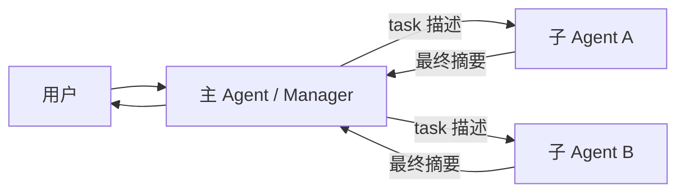
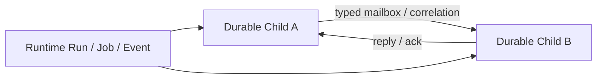
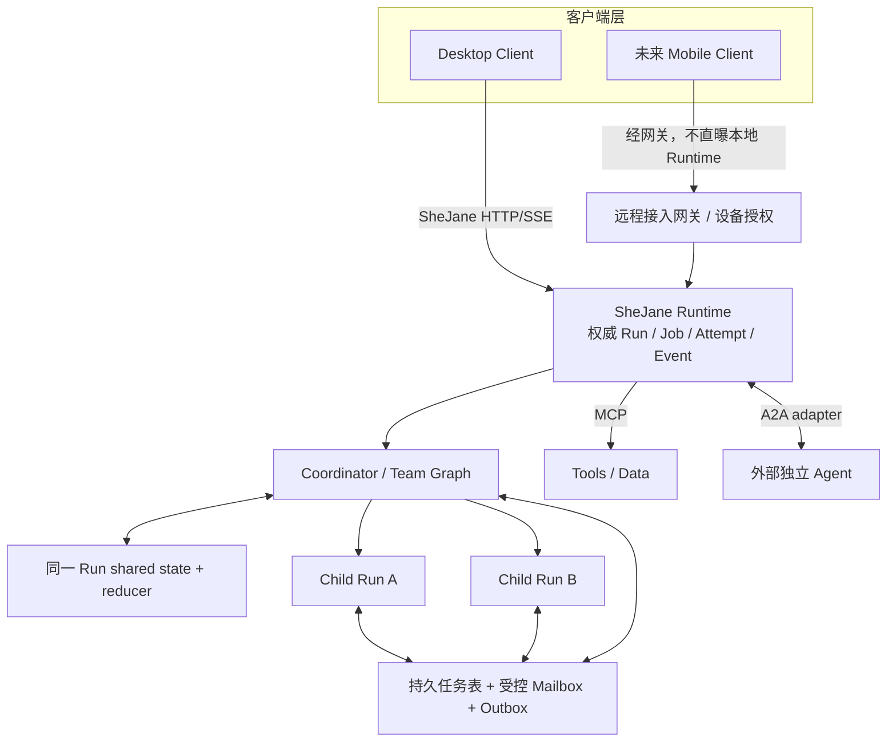

# 多 Agent 架构与互操作标准调研

> 调研截止：2026-08-02
>
> 来源范围：只采用协议/框架官方规范、官方文档和官方仓库。
>
> 研究路由：主要阶段 P6（取得 Agent 定义）；相邻阶段 P5、P7、P10、P12，并通过 P4 投影给客户端。未来状态所有者应继续是 Runtime 的 Run / Job / Attempt、检查点和事件，而不是 Client 或某个第三方 Subagent 中间件。

## 结论先行

1. **研究时发现的内部通信缺口已按阶段 0–4 落地。** 同步 `task()` 仍是最低开销路径；同一 Run 可用 Team Graph，跨时间成员使用 durable child Run，并通过 typed mailbox 直接通信。Coordinator 现在拥有依赖、required/best-effort/quorum、workspace resource owner、取消传播和 root collaboration snapshot。[当前实现](../../runtime/src/shejane_runtime/agent/child_runs.py) · [当前 Run Loop](../run-loop.md)
2. **业界没有一个包办全部问题的“多 Agent 标准”。** 目前成熟做法是分层：内部怎么分工属于编排；跨独立 Agent 服务用 A2A；Agent 调工具/数据用 MCP；Agent 向前端发事件用 AG-UI 或产品自己的协议。
3. **SheJane 最正确的内部实现不是让 LLM 自由群聊，也不是把 A2A 塞进每个本地子 Agent。** 同一 Run 内先用 LangGraph Team Graph、结构化 shared state/reducer 和显式 handoff；只有需要跨时间后台执行、单独恢复或手机端追踪时，才升级为“持久 child Run + 有类型的受控邮箱”。A2A、MCP、AG-UI 只作为边界适配器。
4. **真正值得先做的是生命周期，不是聊天 UI。** 每个子 Agent 必须先有稳定 ID、独立终态、失败/取消、恢复、用量、事件和权限归属；否则 peer messaging 只会把不可诊断的同步调用放大成不可恢复的并发系统。

一句人话：**今天是老板分别问两个同事，再由老板汇总；目标是每个同事都有工号、任务单和受控邮箱，能互相询问，但老板和 Runtime 仍能看见、暂停、追责和恢复整个项目。**

## 1. 研究时基线与当前实现

研究开始时只有这条同步链路；现在仍保留它处理短任务：

阶段 2–4 已增加下面这条受控、持久链路：

同步子 Agent 仍有隔离上下文，`task` 返回结构化摘要；它没有被伪装成长期 Agent。需要稳定地址、恢复、取消或 follow-up 时，父 Agent 显式创建 durable child。当前事实模型和限制见 [`run-loop.md`](../run-loop.md)。

因此要区分三种“沟通”：

| 能力 | 当前 SheJane | 是否算真正 peer communication |
|---|---:|---:|
| 主 Agent 给子 Agent 发一个任务，等待结果 | 有 | 否，属于工具调用式委派 |
| 多个子 Agent 同时工作，由主 Agent 汇总 | 有 | 否，属于 fan-out/fan-in |
| 子 Agent A 按稳定地址向 B 追问，B 可稍后答复 | durable child 有 | 是 |
| 子 Agent 有独立任务、可查询、追加指令、取消和重启恢复 | durable child 有 | 是“高级多 Agent”的基础 |
| Specialist 接管当前用户会话 | 无 | 属于 handoff，不等同 peer messaging |
| 多成员共享任务表、自领取、重分工 | 有界 Team Graph blackboard；无开放式自领取 swarm | 属于 Agent Team / group collaboration |

共享同一个文件夹也不等于通信：它既没有收件确认和顺序，也没有权限、幂等、超时和失败语义，只会制造写入冲突。

## 2. 先把“编排模式”和“通信标准”分开

### 2.1 编排模式

编排模式回答的是：谁决定下一步、谁看得到哪些上下文、失败后怎么办。这通常是框架或产品内部设计，不是跨厂商协议。

| 模式 | 控制权和信息流 | 优点 | 主要风险 | 典型官方实现 |
|---|---|---|---|---|
| Manager-as-tools | Manager 一直掌控用户会话；Specialist 像工具一样返回结果 | 简单、上下文隔离、容易限权 | 子 Agent 不能主动持续协作 | [OpenAI Agents-as-tools](https://openai.github.io/openai-agents-python/tools/#agents-as-tools)、[Deep Agents Subagents](https://docs.langchain.com/oss/python/deepagents/subagents) |
| Router + fan-out/fan-in | Router 把独立子问题并行分发，再汇总 | 吞吐高，适合研究/审查 | 任务必须能独立；共享写入会冲突 | [LangChain Router](https://docs.langchain.com/oss/python/langchain/multi-agent/router)、[OpenAI code orchestration](https://openai.github.io/openai-agents-python/multi_agent/) |
| Handoff | 当前 Agent 把用户会话控制权交给另一个 Agent | Specialist 能直接追问用户，多轮责任清晰 | 历史裁剪、审批和“如何交还”必须定义 | [OpenAI Handoffs](https://openai.github.io/openai-agents-python/handoffs/)、[LangChain Handoffs](https://docs.langchain.com/oss/python/langchain/multi-agent/handoffs) |
| Graph / workflow | 显式节点、边、并行和条件分支 | 可恢复、可测试、行为更确定 | 动态协作不如 mailbox 灵活 | [LangGraph custom workflows](https://docs.langchain.com/oss/python/langchain/multi-agent/custom-workflow)、[Microsoft Agent Framework migration guide](https://learn.microsoft.com/en-us/agent-framework/migration-guide/from-autogen/) |
| Group chat / next-speaker | 成员看共享历史；规则或模型选择下一位发言 | 易做辩论、评审 | token 迅速膨胀，容易循环和角色漂移 | [AutoGen Teams](https://microsoft.github.io/autogen/stable/user-guide/agentchat-user-guide/tutorial/teams.html)、[SelectorGroupChat](https://microsoft.github.io/autogen/stable/user-guide/agentchat-user-guide/selector-group-chat.html) |
| Actor / direct message + pub/sub | 每个 Agent 有地址；可一对一请求，也可向 topic 发布 | 真正异步通信、局部上下文、可扩展 | 投递、幂等、背压、死信和权限复杂 | [AutoGen Core message model](https://microsoft.github.io/autogen/stable/user-guide/core-user-guide/framework/message-and-communication.html)、[Topics and subscriptions](https://microsoft.github.io/autogen/stable/user-guide/core-user-guide/core-concepts/topic-and-subscription.html) |
| Durable child task | 子 Agent 是可独立查询/恢复/取消的后台任务 | 长任务、手机断线、进程重启后仍可继续 | 必须先有完整任务生命周期和资源预算 | [Deep Agents Async Subagents](https://docs.langchain.com/oss/python/deepagents/async-subagents)（Preview） |

没有一种模式永远最好。成熟系统通常组合使用：主链用 Coordinator/graph，独立工作用 durable child task，需要直接对话才 handoff，确有必要时才开放受控 peer messaging。

### 2.2 通信与互操作标准

通信标准回答的是：两个不同进程、框架或厂商怎样发现对方、交换消息和任务。它不负责替产品决定谁是 Manager、如何分工或怎样写共享文件。

| 协议/规范 | 截止 2026-08-02 的官方状态 | 解决什么 | 是否是 Agent↔Agent | 对 SheJane 的判断 |
|---|---|---|---:|---|
| **A2A** | 线协议版本是 **1.0**；规范页仍称最新发布规范为 **1.0.0**，仓库最新补丁 tag 是 **v1.0.1**（changelog 日期 2026-05-26）。Patch 不参与协议协商，实施应固定使用 v1.0.1 的权威 proto。[规范](https://a2a-protocol.org/latest/specification/) · [v1.0.1 proto](https://github.com/a2aproject/A2A/blob/v1.0.1/specification/a2a.proto) · [Releases](https://github.com/a2aproject/A2A/releases) | Agent Card/能力发现、Message、Task、状态、Artifact、SSE/push、取消、订阅，以及 HTTP+JSON、JSON-RPC、gRPC 绑定 | 是 | 作为未来“独立远程 Agent 服务”边界；不要用作本地子 Agent 内部总线 |
| **MCP** | 最新稳定规范是 **2025-11-25**；**2026-07-28 仍是 RC/草案**，官方明确说明尚未 final。[Versioning](https://modelcontextprotocol.io/docs/learn/versioning) · [Releases](https://github.com/modelcontextprotocol/modelcontextprotocol/releases) | Host 连接工具、资源和提示；stdio / Streamable HTTP + JSON-RPC | 否 | 继续用于工具/数据能力；不要把 peer mailbox 伪装成 MCP tool |
| **MCP Tasks** | 在 2025-11-25 规范中仍是实验性能力，双方必须显式协商；支持 durable handle、轮询、取消和终态。[Tasks](https://modelcontextprotocol.io/specification/2025-11-25/basic/utilities/tasks) | 长时间运行的 MCP 请求 | 否 | 可用于“长工具调用”，不能代替 Agent Team 生命周期 |
| **AG-UI** | 开放的 Agent↔前端事件协议；官方事件集中仍有 draft/deprecated 状态，部分框架集成仍标 In Progress。[Introduction](https://docs.ag-ui.com/introduction) · [Events](https://docs.ag-ui.com/concepts/events) | 文本/工具流、状态快照和 delta、活动、HITL、取消、steering、自定义事件 | 否 | 可做未来桌面/手机端适配器或借鉴事件分类；不应替换 Runtime 权威状态 |
| **FIPA ACL** | 2002-12-03 发布的历史标准。[Message Structure](https://www.fipa.org/specs/fipa00061/SC00061G.html) · [Communicative Acts](https://www.fipa.org/specs/fipa00037/SC00037J.html) | performative、sender/receiver、conversation-id、in-reply-to、language/ontology 等 | 是 | 借鉴信封与关联字段；不实现整套 belief/intention 语义和旧传输栈 |
| **ACP** | 官方仓库已于 2025-08-27 归档；官方公告称并入 A2A，停止独立发展。[仓库](https://github.com/i-am-bee/acp) · [合并公告](https://github.com/orgs/i-am-bee/discussions/5) | 曾尝试 Agent 通信 | 曾经是 | 不采用；新互操作目标统一看 A2A |

最容易犯的错误是“看到名字像协议就混用”：

- MCP 是 Agent 使用工具，不是 Agent 成员之间的团队通信。
- AG-UI 是 Runtime/Agent 向用户界面投影，不是 Agent 内部邮箱。
- A2A 是独立 Agent 系统之间的互操作。A2A 官方明确说明它不是 Agent 开发框架、不是内部 subagent/tool-call 协议，也不替代 MCP。[A2A overview](https://a2a-protocol.org/latest/)

## 3. 主流框架现在怎么实现多 Agent

| 框架 | 已有模式 | 能否直接 peer messaging | 生命周期边界 | 对 SheJane 的价值 |
|---|---|---:|---|---|
| **OpenAI Agents SDK** | agents-as-tools、handoff、代码级串并行编排，可组合 evaluator loop | 没有通用 peer mailbox | Handoff 留在一次 run 内；普通 Runner 本身不是 durable distributed runtime。[Multi-agent](https://openai.github.io/openai-agents-python/multi_agent/) · [Handoffs](https://openai.github.io/openai-agents-python/handoffs/) | 借鉴“Manager 委派”和“控制权转移必须是两个概念”；不是线协议，也无需迁移 Runtime |
| **LangChain / LangGraph / Deep Agents** | tool-based supervisor、router、handoff、graph；同步 Subagent 隔离上下文并返回结果 | 同步 Subagent 没有；可自行在 graph/state 中构造 | Deep Agents Async Subagents 提供 launch/check/update/cancel/list，但仍是 **Preview**，依赖 Agent Protocol server。[Multi-agent](https://docs.langchain.com/oss/python/langchain/multi-agent/) · [Async Subagents](https://docs.langchain.com/oss/python/deepagents/async-subagents) | 与现有技术栈最接近；保留同步层，但 durable child Run 应由 SheJane Runtime 拥有，不把 Preview 中间件当事实来源 |
| **AutoGen Core / AgentChat** | Actor 风格 direct request、topic pub/sub；高层有 RoundRobin、Selector、MagenticOne、Swarm | 有 | Embedded runtime 和实验性分布式 runtime；Team 负责高层会话 | 架构证据很有价值，尤其是 direct/topic 两类通道；但官方仓库已进入维护模式，不应新增依赖。[AutoGen repo](https://github.com/microsoft/autogen) |
| **Microsoft Agent Framework 1.0** | 统一 Agent + typed graph Workflow，支持嵌套、group chat、checkpoint/HITL，并对接 A2A/MCP | 以 workflow/executor 为主 | 官方称 1.0 production-ready；当前重点是单进程组合，分布式执行仍在规划。[AutoGen repo notice](https://github.com/microsoft/autogen) · [Migration guide](https://learn.microsoft.com/en-us/agent-framework/migration-guide/from-autogen/) | 是 AutoGen 的正式后继和可参考实现；SheJane 已有 LangGraph/Runtime，不值得为相同层次整体换框架 |

AutoGen 的地位必须说清楚：它的 direct-message/pub-sub 模型仍是很好的设计资料，但官方仓库已经写明 **Maintenance Mode**，新项目应使用 Microsoft Agent Framework 1.0。这里引用 AutoGen 是借鉴模型，不是推荐采用。

## 4. 推荐给 SheJane 的目标架构

内部保留两条执行路径，不把所有 Specialist 都抬升为独立 Run：

1. **同一 Run 的 Team Graph：** 用 LangGraph `Send` 做并行 fan-out，用 reducer 合并结构化 findings/claims/reviews，用 `Command(goto=...)` 做显式 handoff。大结果只传 Artifact 引用。这条路径开销小、可检查点、适合研究、写作和评审闭环。
2. **跨时间的 durable child Run：** 只用于需要后台运行、独立恢复/取消、单独追加指令、跨主 Run 生命周期或手机端稍后查看的成员。此时才需要稳定地址、受控 mailbox 和独立生命周期。

### 4.1 落到 P4 / P6 / P7 / P10 的边界

| Harness 阶段 | 在多 Agent 中负责什么 | 不能负责什么 |
|---|---|---|
| **P4 快照与变化订阅** | 投影 parent/child Run、等待、失败、取消、用量、消息和 artifact；为桌面及未来手机端提供断线回放 | Client 不创建权威 child、不推断终态，也不充当 mailbox |
| **P6 绑定资源并取得 Agent 定义** | 冻结 child 的 Agent 定义版本、模型、工具、工作区、权限子集和预算 | 不在这里执行 Agent，也不让 child 临时扩大父权限 |
| **P7 启动或恢复 LangGraph** | 同一 Run 的 Team Graph 使用 checkpoint、`Send` 和 reducer；每个 durable child 使用独立 checkpoint/thread，从自己的 Attempt 恢复 | LangGraph state 不取代跨 Run 的 Runtime Run/Job/Attempt 事实 |
| **P9 路由 Agent 输出** | 校验 handoff 目标、允许的边和结构化协作结果；决定继续、fan-in、转交或结束 | 不让模型通过自由文本绕过拓扑和权限 |
| **P10 执行工具或等待用户** | 当前同步 `task()` 仍作为快速 request/result 路径；高级模式再增加 spawn、send、wait、follow-up、cancel 和 handoff 控制面 | 不把工具返回值当完整 child 生命周期，也不让 peer message 绕过工具审批和回执 |
| **P12 原子提交结果** | 原子写入 child 终态、结果/artifact、用量、事件和 parent fan-in 可见状态 | 不能先向 Client 宣告完成、随后再补数据库事实 |

**Mailbox 不是修复当前 ephemeral `task()` 的无条件前置。** 先让现有同步 child 的生命周期在 P4/P10/P12 可观测且正确；只有当 child 被提升为独立 durable Run，并且真实任务需要中途协作时，才启用持久 mailbox。短任务仍可走低开销的 `task → result` 路径。

### 4.2 内部事实模型

不要新建第二套独立“Agent runtime”。在现有模型上扩展：

| 现有对象 | 多 Agent 扩展 | 唯一职责 |
|---|---|---|
| Run | `parent_run_id`、`root_run_id`、`agent_definition_id/version`、协作策略 | 一个可独立查询、恢复、取消和结算的 Agent 任务 |
| Job / Attempt | child 的租约、重试、执行代次 | 保证进程崩溃后不会丢任务，也不会让旧 worker 继续写 |
| Event / Snapshot | child 生命周期、消息和 artifact 的权威投影 | Client/手机端断线后可重建，不靠内存事件补历史 |
| Tool receipt / approval | 保留调用者 child Run、能力来源和审批归属 | 子 Agent 不能借父 Agent 身份扩大权限 |
| 新增 AgentMessage（仅 durable child） | 有地址、有类型、可关联、可去重的消息信封 | 跨时间 peer communication；正文与执行生命周期分离 |

`AgentMessage` 最小但够用的字段应包括：

- `message_id`、`root_run_id`、`sender_run_id`、`recipient_run_id` 或受控 `topic`；
- `kind`：先限定为 `request`、`question`、`update`、`result`、`cancel`，不要一开始复制几十个 FIPA performative；
- `parts` / `artifact_refs`：发送结论、证据和产物引用，不发送隐藏思维链；
- `correlation_id`、`in_reply_to`、`sequence`、`created_at`、`deadline`；
- `idempotency_key`、投递/处理状态和 trace context。

消息应采用**持久 inbox/outbox + 至少一次投递 + 幂等消费**。数据库事务同时提交业务状态、事件和 outbox；worker 可重复投递，但收件方不能重复执行外部副作用。不要承诺很难兑现的“恰好一次”。

### 4.3 控制面能力

高级多 Agent 不应只有 `send_message`，至少要形成闭环：

| 能力 | 必须定义的语义 |
|---|---|
| `spawn_child` | 冻结 Agent 定义、模型、工具能力、工作区范围、预算和父子关系；返回稳定 child Run ID |
| `list/check/wait` | 从 Runtime 权威状态读取；支持等待一个、全部、best-effort 或 quorum |
| `send/follow_up` | 指向稳定 Run ID；声明立即中断、排到下一回合还是只作为上下文 |
| `cancel/interrupt` | 取消传播、工具是否可中断、迟到结果如何拒绝、外部副作用如何结算 |
| `handoff` | 与普通消息分开；原子改变 thread 的 active Agent，定义历史过滤、返回 Manager 和审批归属 |
| `complete/fail` | 每个 child 必须独立落到明确终态；失败不能伪装成空摘要 |

### 4.4 权限、预算与并发不变量

- **权限只衰减，不扩张**：child 的工作区、工具、网络、密钥和审批能力必须是父能力的子集；跨 Agent 传递 artifact 不自动转移读取权限。
- **有界拓扑**：限制最大深度、fan-out、同时运行数、消息数、hop/TTL、模型调用、token、工具调用、时间和费用；检测循环依赖。
- **资源归属明确**：并行修改同一文件需要 owner/lease 或 conflict middleware；共享任务表不能等于大家都能写所有资源。
- **失败策略显式**：每次 fan-in 选择 all-required、best-effort 或 quorum；父 Run 完成前处理所有 required child，其他 child 必须取消或明确 detach。
- **取消和恢复可证明**：父取消默认向 required child 传播；Runtime 重启后能从 Run/Job/Attempt 和 checkpoint 重建，不依赖进程内 future。
- **人类审批可路由**：UI 要知道是哪个 child 请求了哪项权限；用户拒绝只影响正确的 attempt，不能误放行整个 team。
- **全链路可观测**：root/parent/child Run、消息、模型调用、工具回执、artifact 和用量共享 trace/correlation；Client 只投影，不推断终态。

### 4.5 与开放协议的映射

内部模型先为本地正确性服务，但保留清晰的边界映射：

| SheJane 内部 | 对外 A2A | 前端投影 | 工具边界 |
|---|---|---|---|
| Agent definition/version/capabilities | Agent Card | 能力清单 | MCP server/tool metadata |
| Child Run | Task | Run snapshot / lifecycle event | MCP Task 仅在具体长工具调用时使用 |
| AgentMessage | Message + Part | message/activity event | tool arguments/result 仍是工具调用 |
| Artifact + permission reference | Artifact / Part | artifact event + authorized fetch | MCP Resource（确实是资源时） |
| Run status + event cursor | TaskStatus + streaming/push | SheJane SSE；未来可加 AG-UI adapter | 不映射为工具返回值 |

这使 A2A 只是外部 adapter，而不是内部存储格式。A2A 的状态和字段升级时，不会迫使 SheJane 改写整个本地运行链。

### 4.6 阶段 5：A2A 1.0 实施基线

#### 版本与权威来源

- 对外只协商 `1.0`：Agent Card 的 `AgentInterface.protocolVersion` 和每次 A2A 操作请求的 `A2A-Version` 都使用 `1.0`。A2A 规范明确规定只用 `Major.Minor` 协商，patch 不影响兼容性。[Versioning](https://a2a-protocol.org/latest/specification/#36-versioning)
- 代码与 fixture 固定到 [`v1.0.1/specification/a2a.proto`](https://github.com/a2aproject/A2A/blob/v1.0.1/specification/a2a.proto)，不要从浮动的 `main` 或 `latest` 生成。规范规定 proto 是所有数据对象和请求/响应的权威定义，SDK、schema 和语言类型都应由它派生。[Normative content](https://a2a-protocol.org/latest/specification/#14-normative-content)
- JSON 使用 ProtoJSON 语义：字段为 `camelCase`，枚举为 proto 中的全大写名字，例如 `TASK_STATE_WORKING`、`ROLE_USER`。[JSON naming](https://a2a-protocol.org/latest/specification/#55-json-field-naming-convention)
- 一个 Agent 可以只声明真实支持的绑定；若同时声明多个绑定，它们必须提供相同操作、等价结果、等价认证和一致错误语义。不要为了“看起来完整”在 Agent Card 中声明尚未通过测试的 transport。[Binding interoperability](https://a2a-protocol.org/latest/specification/#5-protocol-binding-requirements-and-interoperability)

官方资料目前有几处会直接误导实现的漂移，因此优先级必须固定为：**v1.0.1 proto > 1.0 规范正文 > topic/示例页**。

1. 规范页标题仍写“Latest Released Version 1.0.0”，但官方 release 已有 v1.0.1；线协议仍是 `1.0`，这不是两个可协商版本。[Releases](https://github.com/a2aproject/A2A/releases)
2. 规范正文的 REST 表把 `SubscribeToTask` 写成 `POST /tasks/{id}:subscribe`，但 v1.0.1 权威 proto 的 HTTP annotation 是 `GET /tasks/{id}:subscribe`；实现和测试应采用 `GET`。[v1.0.1 service definition](https://github.com/a2aproject/A2A/blob/v1.0.1/specification/a2a.proto#L70-L78)
3. 最新规范页面的 `PushNotificationConfig` 表格渲染为 “Message not found”，而 proto 中实际对象名是 `TaskPushNotificationConfig`，字段为 `tenant`、`id`、`taskId`、`url`、`token`、`authentication`。[v1.0.1 push config](https://github.com/a2aproject/A2A/blob/v1.0.1/specification/a2a.proto#L444-L460)
4. 部分 topic 和示例仍出现 v0.3 名称、`A2A-Version: 0.3` 或 JSON-RPC 的旧式 `category/action` 提示；1.0 必须使用 `supportedInterfaces`、`securitySchemes`、`securityRequirements`、`A2A-Version: 1.0` 和 PascalCase 方法名。
5. “What's New” 页出现 `taskStatusUpdate` / `taskArtifactUpdate`，但 v1.0.1 proto 的 `StreamResponse` 实际字段是 `statusUpdate` / `artifactUpdate`；adapter 只发后者。

#### Agent Card 与发现

公开发现地址是 `GET /.well-known/agent-card.json`。Card 是 JSON 文档，至少包含身份、Agent 自身版本、按优先级排列的 `supportedInterfaces`、能力、默认输入/输出 media type 和 skills；每个 interface 包含 `url`、`protocolBinding`（标准值 `JSONRPC`、`HTTP+JSON`、`GRPC`）、`protocolVersion: "1.0"`，共享端点时可带 opaque `tenant`。[Agent discovery](https://a2a-protocol.org/latest/topics/agent-discovery/) · [AgentCard model](https://a2a-protocol.org/latest/specification/#441-agentcard)

- 公共 Card 不放密钥或内部地址；敏感技能使用需要认证的 `GetExtendedAgentCard`，且只有 `capabilities.extendedAgentCard` 为真时开放。
- HTTP 发现响应应带 `Cache-Control` 和 `ETag`；Card 版本或内容变化后才能可靠失效缓存。
- Card 可用 RFC 7515 JWS 签名；验签时按 proto presence 规则保留或省略默认值、排除 `signatures`、再按 RFC 8785 规范化，并验证至少一个受信签名。签名不能代替 TLS、调用者认证或授权。[Agent Card signatures](https://a2a-protocol.org/latest/specification/#84-agent-card-signature-and-verification)
- `tenant` 是路由值，不是授权证明。客户端选择带 tenant 的 interface 后，每个请求都必须回传同一值；服务端仍按已认证 principal 独立检查租户和资源权限。[Multi-tenancy](https://a2a-protocol.org/latest/topics/multi-tenancy/)

#### 三种标准绑定

| 能力 | JSON-RPC 2.0 | HTTP+JSON/REST | gRPC |
|---|---|---|---|
| 普通消息 | `SendMessage` | `POST /message:send` | `SendMessage` |
| 流式消息 | `SendStreamingMessage` + SSE | `POST /message:stream` + SSE | server-streaming `SendStreamingMessage` |
| 查询/列举 | `GetTask` / `ListTasks` | `GET /tasks/{id}` / `GET /tasks` | `GetTask` / `ListTasks` |
| 取消/订阅 | `CancelTask` / `SubscribeToTask` | `POST /tasks/{id}:cancel` / **`GET /tasks/{id}:subscribe`** | `CancelTask` / server-streaming `SubscribeToTask` |
| push 配置 | Create/Get/List/Delete PascalCase 方法 | `/tasks/{taskId}/pushNotificationConfigs` 的 POST/GET/GET/DELETE | 对应四个 RPC |
| 扩展 Card | `GetExtendedAgentCard` | `GET /extendedAgentCard` | `GetExtendedAgentCard` |

JSON-RPC 请求使用 `application/json`、PascalCase 方法名；HTTP+JSON 应使用 `application/a2a+json`；两种 HTTP streaming 都返回 `text/event-stream`。所有请求都必须携带 `A2A-Version: 1.0`，扩展协商另带 `A2A-Extensions`。[JSON-RPC binding](https://a2a-protocol.org/latest/specification/#9-json-rpc-protocol-binding) · [HTTP+JSON binding](https://a2a-protocol.org/latest/specification/#11-httpjsonrest-protocol-binding) · [v1.0.1 service](https://github.com/a2aproject/A2A/blob/v1.0.1/specification/a2a.proto#L15-L135)

#### Task、Message、Artifact 与 Part

| A2A 对象 | 1.0 必要形状 | SheJane adapter 规则 |
|---|---|---|
| `Task` | 服务端生成的 `id`；可选 `contextId`；必需 `status`；可选 `artifacts`、`history`、`metadata` | 外部 task ID 单独持久化并映射到 Runtime Run，不能把可枚举的内部 Run ID 当跨租户资源标识 |
| `TaskStatus` | 必需 `state`；可选 status `message` 和 timestamp | 只从 Runtime 权威终态/等待态映射；`INPUT_REQUIRED`、`AUTH_REQUIRED` 是中断态，不是失败或完成 |
| `Message` | 创建方生成 `messageId`；必需 `role` 和非空 `parts`；可选 `contextId`、`taskId`、`referenceTaskIds`、extensions/metadata | 输入、澄清、状态说明和 follow-up；规范明确说最终产物不应塞进 Message |
| `Part` | `text`、`raw`（JSON 中 base64）、`url`、`data` **恰好一个**；可带 `mediaType`、`filename`、metadata | URL 只能指向经授权且可过期的下载地址；入站 URL/raw 必须做大小、类型和 SSRF/恶意内容校验 |
| `Artifact` | task 内唯一 `artifactId`；至少一个 `parts`；可选 name/description/extensions/metadata | Run 产物的授权投影；不要暴露本地工作区绝对路径 |

Task 状态全集是 `TASK_STATE_UNSPECIFIED`、`TASK_STATE_SUBMITTED`、`TASK_STATE_WORKING`、`TASK_STATE_COMPLETED`、`TASK_STATE_FAILED`、`TASK_STATE_CANCELED`、`TASK_STATE_INPUT_REQUIRED`、`TASK_STATE_REJECTED`、`TASK_STATE_AUTH_REQUIRED`；其中 completed/failed/canceled/rejected 为终态。[Canonical objects](https://a2a-protocol.org/latest/specification/#41-core-objects) · [v1.0.1 proto](https://github.com/a2aproject/A2A/blob/v1.0.1/specification/a2a.proto#L156-L280)

`SendMessage` 可以返回 `Task` 或直接 `Message`。对接 Runtime 的长期、可恢复执行时应返回 `Task`；只有确定不会产生可查询生命周期的即时无状态响应才返回 `Message`。`SendMessageConfiguration.returnImmediately=false` 的规范语义是等到终态或中断态再返回，不能一律立即回 `SUBMITTED`。[SendMessage](https://a2a-protocol.org/latest/specification/#311-send-message) · [SendMessageConfiguration](https://github.com/a2aproject/A2A/blob/v1.0.1/specification/a2a.proto#L136-L155)

#### Streaming、断线恢复与 push

`StreamResponse` 每条只能是 `Task`、`Message`、`TaskStatusUpdateEvent`、`TaskArtifactUpdateEvent` 之一。`SubscribeToTask` 的第一条必须是当前完整 `Task`，终态时必须关流；artifact 分块通过相同 `artifactId` 加 `append`/`lastChunk` 表示。事件必须按生成顺序传输；同一 task 的并发订阅者应看到同序列。[Subscribe to Task](https://a2a-protocol.org/latest/specification/#316-subscribe-to-task) · [Streaming events](https://a2a-protocol.org/latest/specification/#42-streaming-events)

A2A 1.0 没有定义等价于 SheJane cursor 的持久 replay/ack 协议，规范还明确提醒断线客户端可能漏掉 status message。因此 adapter 不能把 SSE 当事实存储：重连先 `GetTask` 重建当前快照，非终态再 `SubscribeToTask`；关键事实必须落在 Task 状态、Artifact 或 SheJane Runtime 数据库中，不能只存在瞬时 Message。[Messages and artifacts](https://a2a-protocol.org/latest/specification/#37-messages-and-artifacts)

Push 是持久化的 per-task webhook 配置，payload 与 `StreamResponse` 相同，交付保证是**至少尝试一次**而不是恰好一次。实现必须使用 outbox、稳定 notification/config ID 和幂等接收；回调 URL 必须 HTTPS，并在解析与每次连接时阻止 localhost、link-local、私网、DNS rebinding 和重定向绕过，凭证加密保存、按配置使用独立短期 token。[Push payload and delivery](https://a2a-protocol.org/latest/specification/#433-push-notification-payload) · [Push security](https://a2a-protocol.org/latest/specification/#132-push-notification-security)

#### 认证、安全与扩展

- 生产只能经远程接入网关使用 HTTPS/TLS；本地 loopback Runtime 不直接暴露公网。
- 调用者身份在 HTTP/TLS 层建立，不放进 A2A payload；Agent Card 的 `securitySchemes` / `securityRequirements` 可声明 API key、HTTP auth、OAuth 2.0、OIDC、mTLS。凭证通过协议外流程取得；OAuth 公共客户端使用 Authorization Code + PKCE 或 Device Code，服务间调用优先 Client Credentials 或 mTLS。[Security objects](https://a2a-protocol.org/latest/specification/#45-security-objects) · [Enterprise authentication](https://a2a-protocol.org/latest/topics/enterprise-ready/)
- 每个操作在数据库查询前按 principal、tenant/workspace 和 task 归属授权；不存在和无权限统一表现为 not found，避免泄漏 task 是否存在。List、Get、Cancel、Subscribe、push 配置和 Artifact 下载都必须同样限域。[Authorization scoping](https://a2a-protocol.org/latest/specification/#131-data-access-and-authorization-scoping)
- Extension 用带版本的唯一 URI；Agent Card 声明支持/是否 required，请求用 `A2A-Extensions` 选择，Message/Artifact 的 `extensions` 列出实际使用的 URI，扩展数据放 URI 命名的 metadata。breaking change 换 URI；required 扩展不支持时必须报错，不能静默降级到旧版本。[Extensions](https://a2a-protocol.org/latest/specification/#46-extensions)
- 第一版不创建私有 extension，除非核心模型确实无法表达必要字段；内部 trace 用 W3C Trace Context HTTP header，Runtime ID 和权限信息不塞进不透明 metadata。

#### 官方一致性与互操作门槛

官方已经提供比“自己写两个 mock”更强的测试基线：

1. [`a2a-tck`](https://github.com/a2aproject/a2a-tck) 会从 well-known Card 发现 interface，对 JSON-RPC、HTTP+JSON、gRPC 分别运行按 MUST/SHOULD/MAY 分类的兼容测试，并输出 JSON、HTML、JUnit 报告。SheJane 声明的每个 transport 都必须通过全部 MUST；SHOULD 的偏差要有书面理由。
2. [`a2a-itk`](https://github.com/a2aproject/a2a-itk) 用多跳 agent cluster 验证不同官方 SDK 和协议版本之间的 standard、streaming、push、断线后 resubscribe 和 cancel。其 stable v1.0 matrix 已包含 Python、Go、TypeScript、Java 和 Rust。
3. 阶段 5 的“两种独立实现”固定为官方 [`@a2a-js/sdk` v1.0.1](https://github.com/a2aproject/a2a-js/releases/tag/v1.0.1) 与 [`a2a-go` v2.4.0](https://github.com/a2aproject/a2a-go/releases/tag/v2.4.0)，两者均在 2026-07-28 发布；既让它们作为 client 调 SheJane，也让 SheJane client 调它们的 v1.0 reference agent。覆盖普通、SSE、follow-up、input/auth required、artifact 分块、list/get/cancel、push 和错误映射。再用 [`a2a-python` v1.1.2](https://github.com/a2aproject/a2a-python/releases/tag/v1.1.2) 作为第三个 oracle。
4. [`a2a-inspector`](https://github.com/a2aproject/a2a-inspector) 适合人工检查 Card 和原始报文，但它只做 basic validation，不能替代 TCK/ITK 的 CI gate。

TCK 当前没有正式 release/tag，因此测试 manifest 必须固定 A2A spec tag、TCK/ITK commit 和 SDK release，禁止 CI 使用 `latest`。若 TCK、ITK 与固定 proto 产生冲突，先保存最小报文和版本证据并判定是 adapter bug 还是上游规范/工具 bug，不能为过测试悄悄改 wire shape。

#### Phase 5 实施清单

- [x] **边界：** A2A server/client 只存在于独立 Gateway adapter；P4/P5/P6/P10/P12 的 Runtime Run、Job、Attempt、Event、Artifact 仍是唯一事实源。
- [x] **版本：** 固定 v1.0.1 proto 和 `A2A-Version: 1.0`；Card 只声明已通过测试的 JSON-RPC、streaming、push 和 extended Card，不借测试结果虚构 REST/gRPC。
- [x] **发现：** public/extended Agent Card 有 ETag/Last-Modified 缓存、版本和最小技能投影，不泄漏凭证/内部路径。当前不声明 Card signature；outbound 可要求调用方提供 signature verifier，内置 JWS 只有在产品确定 trust root 后才实现。
- [x] **持久映射：** principal/tenant 与外部 task/context/message/artifact ID 原子映射到内部资源；相同 message ID 重放不重复创建 Run、文件或 push。
- [x] **操作：** Send/stream、Get/List/Cancel/Subscribe、extended Card 和 push CRUD 都从 Runtime 权威事务/事件映射；终态、follow-up、historyLength 和真实 Runtime replay 有契约/E2E。
- [x] **内容：** ProtoJSON oneof、必需字段、media type、正文/文件大小、raw/URL 和 URL 每跳都严格验证；Artifact 下载使用 peer 绑定的一小时内签名，不暴露本地路径。
- [x] **流：** SSE 保持 Runtime 已提交事件顺序；Send/Subscribe 先发完整 Task，再投影变化和终态，不承诺 A2A 未定义的持久 cursor。
- [x] **push：** 持久 config/outbox、稳定 delivery ID、至少一次投递、加密 secret、重试/退避、删除撤销、Gateway 重启恢复，以及 SSRF/DNS rebinding/redirect/租户隔离均有测试。
- [x] **安全：** HTTPS/TLS、opaque bearer/OIDC/mTLS、每操作 scope、not-found 防枚举、速率限制、审计和 W3C trace 已落地；本地 Runtime 继续只监听 loopback。
- [x] **一致性：** 固定 TCK 的声明 binding MUST 100%；固定 ITK 的 14 个 standard/stream/push/resubscribe/cancel/多跳场景全部通过；JS v1.0.1、Go v2.4.0 双向互操作，Python v1.1.2 作第三 oracle。
- [x] **故障证据：** Gateway 重启、Runtime replay、断线重订阅、重复消息/通知、取消、终态 follow-up、过期/轮换/撤销 token、OIDC outage 和跨 tenant/task 探测均有自动化证据。

固定版本、原始结果摘要、两项非 MUST 偏差和所有仅测试适配见 [`../a2a-conformance.md`](../a2a-conformance.md)。

## 5. 分阶段实施顺序

| 阶段 | 交付内容 | 验收标准 |
|---|---|---|
| 0. 补齐现有 Subagent 生命周期投影 | 为一次性调用建立稳定 invocation/operation ID，投影 spawn/start/complete/fail/cancel、usage、父子关联和明确终态 | 失败、取消、重连和父 Run 结算在事件/快照中一致；不把一次性调用伪装成可继续通信的长期 Agent |
| 1. 同一 Run 的 Team Graph | P6 冻结 roster/边/权限；P7/P9 增加 `Send`、reducer blackboard 和显式 handoff；大内容使用 Artifact 引用 | 并行、评审和 handoff 可检查点/重放；没有共享原始思维链或静默文件冲突 |
| 2. Runtime-owned durable child Run | 复用 Run/Job/Attempt/lease/checkpoint；支持 list/check/wait/cancel | Runtime 进程重启、Client 断线后仍能列出和恢复 child；迟到 attempt 不能覆写新代次 |
| 3. 受控 direct mailbox | 只为 durable child 加 typed envelope、inbox/outbox、follow-up、背压、TTL、幂等、权限检查 | A 可向 B 提问并关联回复；重复投递不重复副作用；循环和越权被阻止 |
| 4. Coordinator + 手机端投影 | 任务依赖、required/best-effort/quorum、资源 owner；移动端可看 child、steer、审批和取消 | 手机断线重连不丢状态；父失败/取消后没有遗留 required child |
| 5. A2A federation | 固定 A2A 1.0/v1.0.1 proto；Agent Card、Task/Message/Artifact adapter、认证、多租户作用域、SSE/push | 官方 TCK 的 MUST 全过；官方 ITK 覆盖 stream/push/resubscribe/cancel；与官方 JS v1.0.1、Go v2.4.0 双向互操作，Python v1.1.2 作第三 oracle；本地 Runtime 不直接暴露公网 |

截至 2026-08-03，本表阶段 0–5 已进入当前实现并有 Runtime、HTTP、SDK、TCK/ITK 与单执行槽 E2E 证据。阶段 5 是独立 Agent 的 A2A federation Gateway；阶段 4 给未来手机端的是 cursor-safe 协作快照和对现有 steer/HITL/cancel 接口的复用。两者都不等于手机端所需的设备配对、撤销和用户远程 Runtime Gateway。

每个阶段都应有对照 Eval：单 Agent、Manager fan-out、peer collaboration 在成功率、耗时、token/成本、冲突和恢复能力上比较。只有 peer 模式在真实任务上显著获益，才扩大开放范围。

## 6. 明确不建议做什么

- **不采用 AutoGen 作为新依赖。** 它已进入维护模式；借鉴 actor/direct/topic 模型即可。Microsoft Agent Framework 1.0 是后继，但整体迁移只会与现有 LangGraph 和 Runtime 重叠。
- **不把 A2A 当本地函数调用协议。** 它适合独立 Agent 服务的网络边界，内部使用会增加序列化、认证和版本复杂度，却不自动带来 durable lifecycle。
- **不把 MCP tool 假装成 teammate。** 工具可以内部调用 Agent，但对 Host 来说仍是一次工具调用，不会自动产生身份、邮箱、handoff 和团队恢复语义。
- **不把 Deep Agents Async Subagents Preview 当状态所有者。** 可以做验证性 adapter；正式状态必须写入 SheJane Runtime 的数据库、事件和检查点。
- **不现在整体切换 AG-UI。** 先修正 Runtime 权威事件和生命周期，再评估给桌面/手机端增加兼容 adapter。
- **不采用 ACP，也不完整实现 FIPA ACL。** ACP 已并入 A2A；FIPA 只借鉴 sender/receiver、conversation/correlation、reply/deadline 等成熟信封概念。
- **不做无限递归 Swarm、全量广播或共享原始上下文。** 默认一层 Coordinator + 有界 child，按需开放 direct message；共享的是任务、摘要、证据和 artifact，不是所有 Agent 的完整 transcript 或隐藏推理。

## 7. 最终建议

SheJane 应把“高级多 Agent”定义为两个逐级增强的层次：

> **短时协作由同一 Run 内可检查点、可约束的 Team Graph 完成；需要跨时间协作时，成员才成为有稳定身份和独立生命周期的 child Run，并在 Runtime 的权限、预算、事件和恢复机制下通过有类型、可追踪、可取消的 mailbox 协作。**

协议分工则固定为：

- **Runtime 内部：** 同一 Run 使用 LangGraph Team Graph；跨时间成员才使用 SheJane 自有 durable child Run + mailbox；
- **Agent 调工具：** MCP；
- **外部独立 Agent：** A2A 1.0；
- **桌面/手机界面：** 现有 SheJane HTTP/SSE 为事实协议，必要时增加 AG-UI adapter；
- **编排实现：** 继续用 LangGraph/Deep Agents 作为执行层，但生命周期由 SheJane Runtime 拥有。

这不是“功能最少”的路线，而是把多 Agent 最容易出事故的身份、状态、权限、取消、恢复和协议边界一次放对。它也允许以后接手机端、远程 Runtime 和第三方 A2A Agent，而无需再次推翻内部架构。

## 官方来源索引

- A2A：[Overview](https://a2a-protocol.org/latest/) · [Specification 1.0](https://a2a-protocol.org/latest/specification/) · [v1.0.1 normative proto](https://github.com/a2aproject/A2A/blob/v1.0.1/specification/a2a.proto) · [Agent discovery](https://a2a-protocol.org/latest/topics/agent-discovery/) · [Task lifecycle](https://a2a-protocol.org/latest/topics/life-of-a-task/) · [Streaming and async](https://a2a-protocol.org/latest/topics/streaming-and-async/) · [Multi-tenancy](https://a2a-protocol.org/latest/topics/multi-tenancy/) · [Enterprise security](https://a2a-protocol.org/latest/topics/enterprise-ready/) · [Extension governance](https://a2a-protocol.org/latest/topics/extension-and-binding-governance/) · [Releases](https://github.com/a2aproject/A2A/releases)
- A2A 测试与实现：[TCK](https://github.com/a2aproject/a2a-tck) · [ITK](https://github.com/a2aproject/a2a-itk) · [Inspector](https://github.com/a2aproject/a2a-inspector) · [JS SDK v1.0.1](https://github.com/a2aproject/a2a-js/releases/tag/v1.0.1) · [Go SDK v2.4.0](https://github.com/a2aproject/a2a-go/releases/tag/v2.4.0) · [Python SDK v1.1.2](https://github.com/a2aproject/a2a-python/releases/tag/v1.1.2) · [Java SDK](https://github.com/a2aproject/a2a-java) · [.NET SDK](https://github.com/a2aproject/a2a-dotnet)
- MCP：[Architecture](https://modelcontextprotocol.io/docs/learn/architecture) · [Versioning](https://modelcontextprotocol.io/docs/learn/versioning) · [2025-11-25 Tasks](https://modelcontextprotocol.io/specification/2025-11-25/basic/utilities/tasks) · [2026-07-28 RC](https://github.com/modelcontextprotocol/modelcontextprotocol/releases)
- AG-UI：[Introduction](https://docs.ag-ui.com/introduction) · [Architecture](https://docs.ag-ui.com/concepts/architecture) · [Events](https://docs.ag-ui.com/concepts/events)
- OpenAI Agents SDK：[Multi-agent orchestration](https://openai.github.io/openai-agents-python/multi_agent/) · [Handoffs](https://openai.github.io/openai-agents-python/handoffs/) · [Agents as tools](https://openai.github.io/openai-agents-python/tools/#agents-as-tools)
- LangChain / LangGraph / Deep Agents：[Multi-agent patterns](https://docs.langchain.com/oss/python/langchain/multi-agent/) · [Subagents](https://docs.langchain.com/oss/python/deepagents/subagents) · [Async Subagents](https://docs.langchain.com/oss/python/deepagents/async-subagents) · [Supervisor recommendation](https://github.com/langchain-ai/langgraph-supervisor-py)
- Microsoft：[AutoGen direct and broadcast messaging](https://microsoft.github.io/autogen/stable/user-guide/core-user-guide/framework/message-and-communication.html) · [AutoGen Teams](https://microsoft.github.io/autogen/stable/user-guide/agentchat-user-guide/tutorial/teams.html) · [AutoGen maintenance notice](https://github.com/microsoft/autogen) · [Microsoft Agent Framework migration guide](https://learn.microsoft.com/en-us/agent-framework/migration-guide/from-autogen/)
- 历史与合并状态：[FIPA ACL Message Structure](https://www.fipa.org/specs/fipa00061/SC00061G.html) · [FIPA Communicative Acts](https://www.fipa.org/specs/fipa00037/SC00037J.html) · [ACP archived repository](https://github.com/i-am-bee/acp) · [ACP merged into A2A](https://github.com/orgs/i-am-bee/discussions/5)
